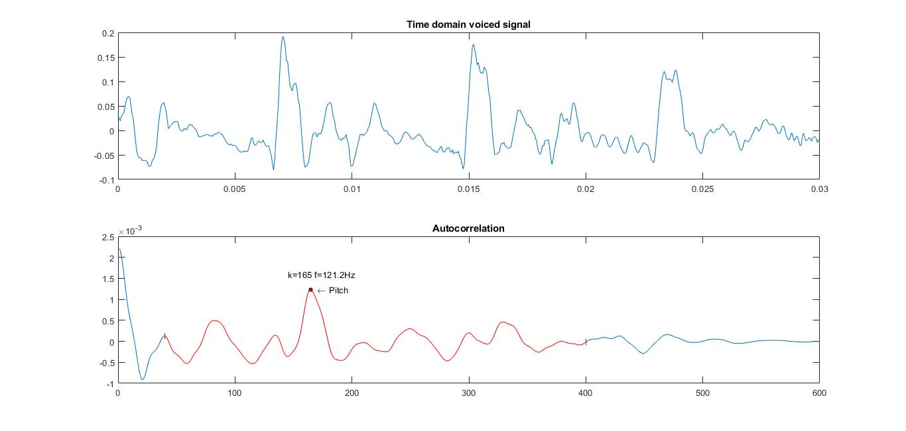

PAV - P3: estimación de pitch
=============================

Esta práctica se distribuye a través del repositorio GitHub [Práctica 3](https://github.com/albino-pav/P3).
Siga las instrucciones de la [Práctica 2](https://github.com/albino-pav/P2) para realizar un `fork` de la
misma y distribuir copias locales (*clones*) del mismo a los distintos integrantes del grupo de prácticas.

Recuerde realizar el *pull request* al repositorio original una vez completada la práctica.

Ejercicios básicos
------------------

- Complete el código de los ficheros necesarios para realizar la estimación de pitch usando el programa
  `get_pitch`.

   * Complete el cálculo de la autocorrelación e inserte a continuación el código correspondiente.
	

	
	

	
   * Inserte una gŕafica donde, en un *subplot*, se vea con claridad la señal temporal de un segmento de
     unos 30 ms de un fonema sonoro y su periodo de pitch; y, en otro *subplot*, se vea con claridad la
	 autocorrelación de la señal y la posición del primer máximo secundario.

	 NOTA: es más que probable que tenga que usar Python, Octave/MATLAB u otro programa semejante para
	 hacerlo.
	 
		 *En la primera gráfica observamos un fragmento de 30ms de la señal x, tiene 600 muestras. 
		 En la segunda gràfica podemos ver la autocorrelación de esta gràfica. Tiene un máximo en 0. 
		 El siguiente máximo lo encontramos en la muestra 126, que corresponde al pitch (f0=122Hz).
		 Este máximo lo buscamos en el periodo (marcado en rojo) correspondiente a un pitch que se
		 encuentre entre 500Hz (muestra 40) i 50Hz (muestra 400)*

   * Determine el mejor candidato para el periodo de pitch localizando el primer máximo secundario de la
     autocorrelación. Inserte a continuación el código correspondiente.
     
     	

	
	

		*Como hemos visto en el apartado anterior, la distancia al primer máximo secundario de la autocorrelación
		nos da el periodo del pitch. Con la frecuencia de muestreo podemos obtener el pitch, en el caso de la
		foto anterior seria de unos 122Hz*

   * Implemente la regla de decisión sonoro o sordo e inserte el código correspondiente.

     	

	
	

		*Para tomar la decisión sonoro/sordo usamos los parámetros explicados en la foto. 
		Al ser lindares o thresholds, el espacio 'sordo' està acotado por lindares en cada dimensión de los paràmetros.
		Para otro proyecto vemos más conveniente usar alguna expresión aritmètica que relacione varios parametros entre si
		para tomar la decisión conjunta i crear un espacio "menos cuadrado"*

- Una vez completados los puntos anteriores, dispondrá de una primera versión del estimador de pitch. El 
  resto del trabajo consiste, básicamente, en obtener las mejores prestaciones posibles con él.

  * Utilice el programa `wavesurfer` para analizar las condiciones apropiadas para determinar si un
    segmento es sonoro o sordo. 
	
	  - Inserte una gráfica con la estimación de pitch incorporada a `wavesurfer` y, junto a ella, los 
	    principales candidatos para determinar la sonoridad de la voz: el nivel de potencia de la señal
		(r[0]), la autocorrelación normalizada de uno (r1norm = r[1] / r[0]) y el valor de la
		autocorrelación en su máximo secundario (rmaxnorm = r[lag] / r[0]).

		Puede considerar, también, la conveniencia de usar la tasa de cruces por cero.

	    Recuerde configurar los paneles de datos para que el desplazamiento de ventana sea el adecuado, que
		en esta práctica es de 15 ms.
		
		

      	- Use el estimador de pitch implementado en el programa `wavesurfer` en una señal de prueba y compare
	    su resultado con el obtenido por la mejor versión de su propio sistema.  Inserte una gráfica
		ilustrativa del resultado de ambos estimadores.
     
		Aunque puede usar el propio Wavesurfer para obtener la representación, se valorará
	 	el uso de alternativas de mayor calidad (particularmente Python).
		
  		
		
			*Podem veure el pitch esperat (a dalt) i el pitch que hem detectat (a sota).*
		
  * Optimice los parámetros de su sistema de estimación de pitch e inserte una tabla con las tasas de error
    y el *score* TOTAL proporcionados por `pitch_evaluate` en la evaluación de la base de datos 
	`pitch_db/train`..

Ejercicios de ampliación
------------------------

- Usando la librería `docopt_cpp`, modifique el fichero `get_pitch.cpp` para incorporar los parámetros del
  estimador a los argumentos de la línea de comandos.
  
  Esta técnica le resultará especialmente útil para optimizar los parámetros del estimador. Recuerde que
  una parte importante de la evaluación recaerá en el resultado obtenido en la estimación de pitch en la
  base de datos.

  * Inserte un *pantallazo* en el que se vea el mensaje de ayuda del programa y un ejemplo de utilización
    con los argumentos añadidos.
    
    

- Implemente las técnicas que considere oportunas para optimizar las prestaciones del sistema de estimación
  de pitch.

  Entre las posibles mejoras, puede escoger una o más de las siguientes:

  * Técnicas de preprocesado: filtrado paso bajo, diezmado, *center clipping*, etc.

  * Técnicas de postprocesado: filtro de mediana, *dynamic time warping*, etc.

  * Métodos alternativos a la autocorrelación: procesado cepstral, *average magnitude difference function*
    (AMDF), etc.
	
  * Optimización **demostrable** de los parámetros que gobiernan el estimador, en concreto, de los que
    gobiernan la decisión sonoro/sordo.
    
    
    
  * Cualquier otra técnica que se le pueda ocurrir o encuentre en la literatura.

  Encontrará más información acerca de estas técnicas en las [Transparencias del Curso](https://atenea.upc.edu/pluginfile.php/2908770/mod_resource/content/3/2b_PS%20Techniques.pdf)
  y en [Spoken Language Processing](https://discovery.upc.edu/iii/encore/record/C__Rb1233593?lang=cat).
  También encontrará más información en los anexos del enunciado de esta práctica.

  Incluya, a continuación, una explicación de las técnicas incorporadas al estimador. Se valorará la
  inclusión de gráficas, tablas, código o cualquier otra cosa que ayude a comprender el trabajo realizado.

  También se valorará la realización de un estudio de los parámetros involucrados. Por ejemplo, si se opta
  por implementar el filtro de mediana, se valorará el análisis de los resultados obtenidos en función de
  la longitud del filtro.
  
   * Técnicas de preprocesado

	+ Center clipping
		*Una posibilidad que ofrece nuestro programa es el uso del center-clipping. Usando la opcion `--cclipping=FLOAT` 
		se puede escogerel valor que tomarà este threshold. El lindar tiene un valor relativo, entre 0 i el valor máximo de la senyal.
		El valor óptimo que hemos encontrado es 0.009. 
		Esta técnica nos ha resultado bastante útil i ha subido bastante el % de nuestro resultado*
		
		

	+ Filtrado paso bajo y diezmado
		*Estas dos opciones las realizamos juntas. Se filtra la señal a la vez que se diezma. 
		El usuario puede escoger dos tipos de filtro, uno con respuesta impulsional triangular y otro con respuesta impulsional rectangular.
		También puede escoger el factor por el cual se diezma. El valor por defecto es 4. 
		Esta técnica también nos ha resultado muy útil.
		Se puede configurar al ejecutar el programa usando el argumento `==downsampl=INT` para escoger el factor de diezmado 
		y `==lpfwindow=INT` para escoger la ventana deseada (0: rectangular, 1: triangular)*
		
		
		
			*Resultado obtenido usando los dos filtros i con los otros parametros igual*
		
		
		
			*Diezmando por diferentes factores vemos como mejora el resultado*
		
  * Técnicas de postprocesado

	+ Filtro de mediana
		*También hemos aplicado el filtro de mediana. El usuario puede escoger el número de errores que corrige.
		Por lo tanto, si este valor es N, se calculará la mediana de 2N+1 valores. 
		Lamentablemente, no ha mostrado muy buenos resultados, aunque el filtro funciona estupendapente.
		Aun así està disponible para ser usado con el argumento `==medianfilt=INT`*
		
		
		
			*En la imagen vemos como funciona bien, este es un filtro que cubre 2 errores. Se ve como coje del vector grande
		5 muestras desplazando una muestra a cada repetición y lo ordena. Los packs de dos lineas, la linea de arriba es
		el vector sin ordenar i la de abajo el vector ordenado*

  * Hemos usado la autocorrelación normal.
	
  * Optimización de los parámetros
  	
	*Uilizando fors en bash hemos encontrado los máximos de los parametros que podemos introducir como argumentos*
	
	
	
    
  * Cualquier otra técnica que se le pueda ocurrir o encuentre en la literatura.

	*Hemos utilizado una técnica que se nos ha ocurrido que es buscar los extremos relativos de la función de correlación*
	
	
	
	
		*Vemos que en los fragmentos unvoiced la correlación tiene muchos extremos*
		
		
	
	
	
		*Y que los fragmentos voiced la correlación no tiene tantos*
	

   

Evaluación *ciega* del estimador
-------------------------------

Antes de realizar el *pull request* debe asegurarse de que su repositorio contiene los ficheros necesarios
para compilar los programas correctamente ejecutando `make release`.

Con los ejecutables construidos de esta manera, los profesores de la asignatura procederán a evaluar el
estimador con la parte de test de la base de datos (desconocida para los alumnos). Una parte importante de
la nota de la práctica recaerá en el resultado de esta evaluación.
